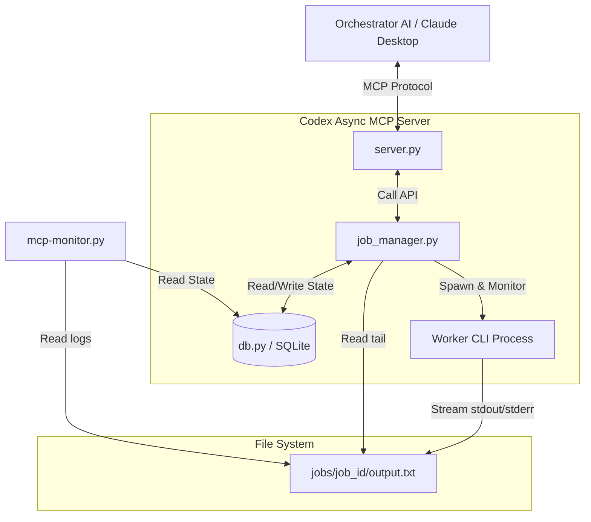
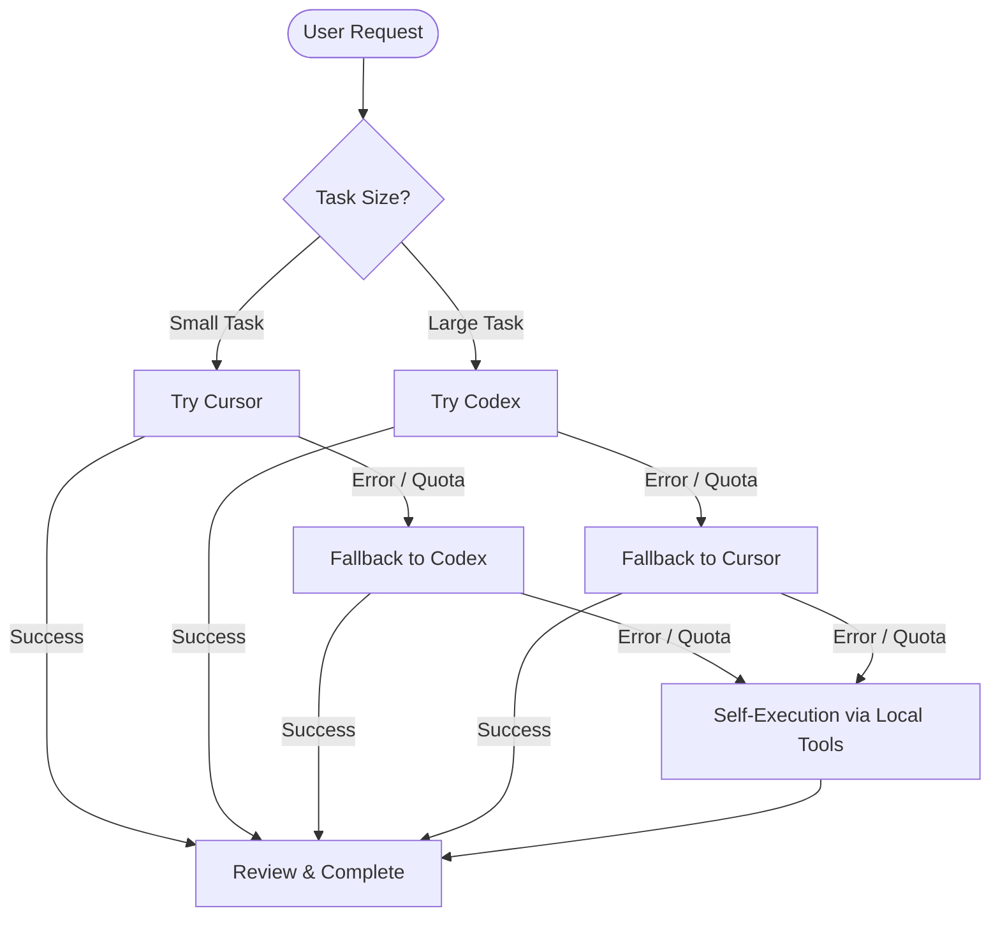

# Codex Async MCP Architecture

This document describes the internal architecture of the `codex-async-mcp` project.

## High-Level Overview

`codex-async-mcp` is an asynchronous Model Context Protocol (MCP) server that acts as a middleware queue between an orchestrator AI (e.g., Claude Desktop) and worker AI agents (e.g., Codex CLI, Cursor Agent).

Instead of making the orchestrator block and wait for long-running worker tasks directly (which can cause timeouts), this MCP server manages jobs in a background queue. The orchestrator can enqueue tasks instantly and then poll/wait for results safely.

## Core Components

### 1. The Server Layer (`src/codex_async_mcp/server.py`)
- Built using `fastmcp`.
- Exposes tools to the orchestrator: `codex_start`, `codex_wait`, `codex_queue_status`, `codex_list`, `codex_await_any`, `codex_cancel`.
- Acts purely as a translation layer between MCP JSON-RPC and the internal Job Manager API.

### 2. The Job Manager (`src/codex_async_mcp/job_manager.py`)
The "brain" of the application. It enforces a **Sequential Queue** (only one worker runs at a time).
- **Spawning**: Wraps the worker CLI (`codex` or `cursor`) in a `subprocess.Popen`.
- **Concurrency**: Uses `threading.Event` so `codex_wait` can block efficiently without busy-polling.
- **Monitoring (`_monitor` thread)**: A dedicated background thread watches the worker process. It detects process exit, timeouts (`MAX_JOB_DURATION`), and stalled outputs (`OUTPUT_STALL_TIMEOUT`).
- **Recovery**: Handles MCP server restarts gracefully. If the server restarts, `wait_for_job` can spawn a lightweight PID-watcher to reattach to the orphaned process.

### 3. State Management (`src/codex_async_mcp/db.py`)
- Uses **SQLite in WAL (Write-Ahead Logging) mode**.
- The database (`~/.codex-async/queue.db`) is the **Single Source of Truth**.
- Tables: `jobs` (tracks `job_id`, `status`, `prompt`, `agent_type`, `pid`, `exit_code`).
- WAL mode ensures that the background monitor writing status updates does not lock out the orchestrator or the CLI dashboard reading the status.

### 4. File Storage (`jobs/<job_id>/output.txt`)
- While metadata lives in SQLite, large raw text streams (stdout/stderr) from the worker CLI are piped directly to disk.
- The `job_manager.py` only reads the tail end of this file (e.g., last 100 lines / max 8000 chars) to return to the orchestrator, preventing memory bloat.

### 5. Real-time Dashboard (`mcp-monitor.py`)
- A standalone CLI script.
- Utilizes Double-Buffering (in-memory string building + ANSI escape sequences) to provide a flicker-free real-time view of the `queue.db` and live tail of `output.txt`.
- Operates entirely out-of-band by just reading the DB and Filesystem without affecting the MCP server.

## Workflow: From Prompt to Completion

1. **Enqueue**: Claude calls `codex_start`. `server.py` calls `start_job`. The job is saved to SQLite as `pending`. If the queue is empty, `job_manager` spawns the worker immediately. Returns `job_id`.
2. **Execute**: The worker CLI (e.g., Cursor) executes. Its stdout is piped to `output.txt`. The `_monitor` thread waits for it to finish.
3. **Wait**: Claude calls `codex_wait`. The thread blocks on a `threading.Event`.
4. **Completion**: The worker finishes. `_monitor` updates SQLite to `done`, and triggers the event.
5. **Return**: `codex_wait` wakes up, reads the tail of `output.txt`, parses token usage, checks for truncation, and returns the final JSON to Claude.

## Smart Agent Orchestration & Fallback Workflow

While the technical workflow handles how the MCP server manages background processes, the **Orchestrator AI (Manager)** governs *how* those processes are used. The system is designed to use a strict routing and fallback protocol to ensure maximum reliability and efficiency:

1. **Initial Routing (Size-Based)**: 
   - **Cursor Agent (`agent_type="cursor"`)**: Handles "Small Tasks" (e.g., minor bug fixes, targeted refactoring in a single file).
   - **Codex CLI (`agent_type="codex"`)**: Handles "Large Tasks" (e.g., complex logic, multi-file changes, requiring deep context).
   
2. **Execution & Review**:
   The Manager dispatches the job via `codex_start` and blocks via `codex_wait`. Once returned, the Manager actively reviews the output and the underlying `git diff`.
   
3. **Cross-Agent Fallback**:
   If the chosen agent fails due to quota limits, rate limits, or crashes (returning `status: error` or incomplete code), the Manager **does not fail**. Instead, it dynamically re-assigns the exact same prompt to the *other* available worker agent.
   - *Cursor fails* → Route to Codex.
   - *Codex fails* → Route to Cursor.

4. **Self-Execution (Final Fallback)**:
   If both worker agents fail or the MCP server is unreachable, the Manager assumes direct control. It utilizes its own local toolset (file editing, shell commands) to complete the user's request, acting as the ultimate fallback layer.

This multi-tiered architecture ensures that simple tasks stay fast and cheap, complex tasks get the required attention, and system failures are gracefully mitigated without bothering the user.
